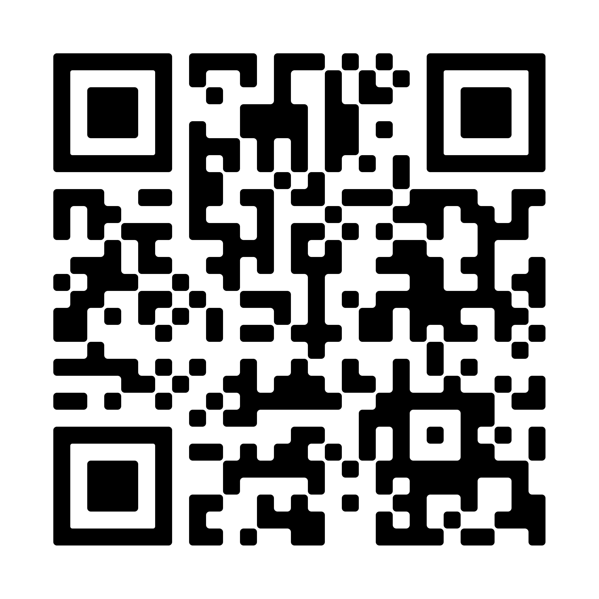

<!DOCTYPE html>
<html lang="id">
<head>
    <meta charset="UTF-8">
    <meta name="viewport" content="width=device-width, initial-scale=1.0">
    <title>Detail Jaringan Wi-Fi</title>
    <!-- Menggunakan font modern dari Google Fonts -->
    <link href="https://googleapis.com" rel="stylesheet">
    
    
</head>
<body>

    

        

            <h1>Detail Jaringan Wi-Fi</h1>
            
Gunakan informasi di bawah untuk terhubung

        

        <!-- Jaringan 1 -->
        

            
Jaringan 1

            
            

                
Nama Wi-Fi (SSID)

                
NASI UDUK FR

            

            
            

                
Kata Sandi

                
2U346J2J88

            

            <!-- Barcode berada di bawah teks -->
            

                

                    <!-- Ganti src dengan link/path gambar barcodemu -->
                    
                

                
Scan Me

                <button class="btn-copy" onclick="copyText('pass1', this)">Salin Kata Sandi</button>
            

        

        <!-- Jaringan 2 -->
        

            
Jaringan 2

            
            

                
Nama Wi-Fi (SSID)

                
NASI UDUK FR_4G

            

            
            

                
Kata Sandi

                
2U346J2J88

            

            <!-- Barcode berada di bawah teks -->
            

                

                    <!-- Ganti src dengan link/path gambar barcodemu -->
                    
                

                
Scan Me

                <button class="btn-copy" onclick="copyText('pass2', this)">Salin Kata Sandi</button>
            

        

    

    <!-- Script Salin Teks Otomatis -->
    
</body>
</html>
