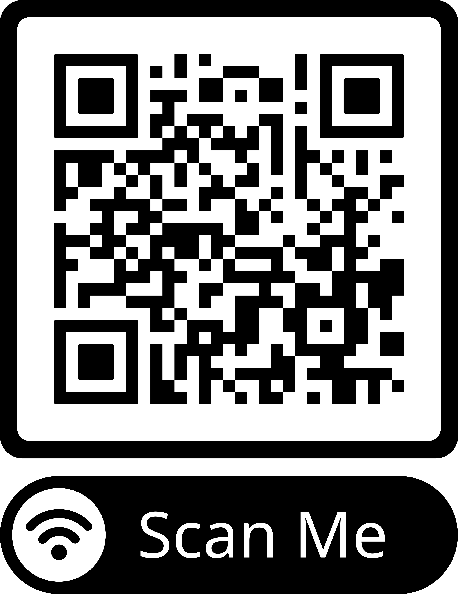

<!DOCTYPE html>
<html lang="id">
<head>
    <meta charset="UTF-8">
    <meta name="viewport" content="width=device-width, initial-scale=1.0">
    <title>Detail Jaringan Wi-Fi</title>
    
</head>
<body>

    

        

            <h1>Detail Jaringan Wi-Fi</h1>
            
Gunakan informasi di bawah untuk terhubung

        

        <!-- Jaringan 1 -->
        

            

                <h2>Jaringan 1</h2>
                

                    
Nama Wi-Fi (SSID)

                    
NASI UDUK FR

                

                

                    
Kata Sandi

                    
2U346J2J88

                

                <button class="btn-copy" onclick="copyPassword('pass1')">Salin Kata Sandi</button>
            

            

                <!-- Anda bisa mengganti URL src gambar ini dengan file gambar QR code asli Anda nanti -->
                
                

                

            

        

        <!-- Jaringan 2 -->
        

            

                <h2>Jaringan 2</h2>
                

                    
Nama Wi-Fi (SSID)

                    
NASI UDUK FR_4G

                

                

                    
Kata Sandi

                    
2U346J2J88

                

                <button class="btn-copy" onclick="copyPassword('pass2')">Salin Kata Sandi</button>
            

            

                <!-- Anda bisa mengganti URL src gambar ini dengan file gambar QR code asli Anda nanti -->
                
                

                

            

        

    

    <!-- Elemen Toast untuk pesan berhasil salin -->
    
Kata sandi berhasil disalin!

    
</body>
</html>
